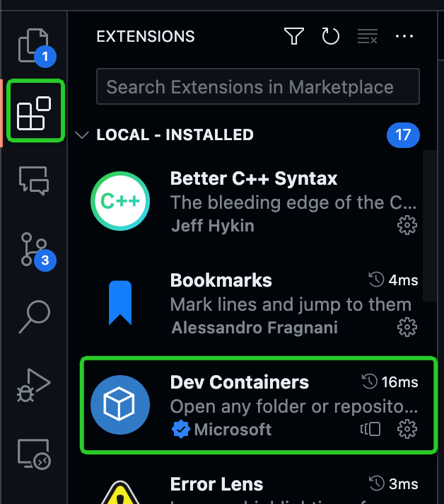
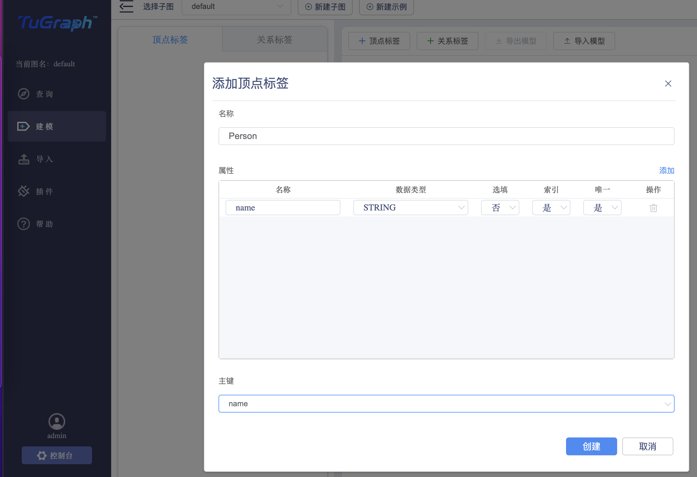
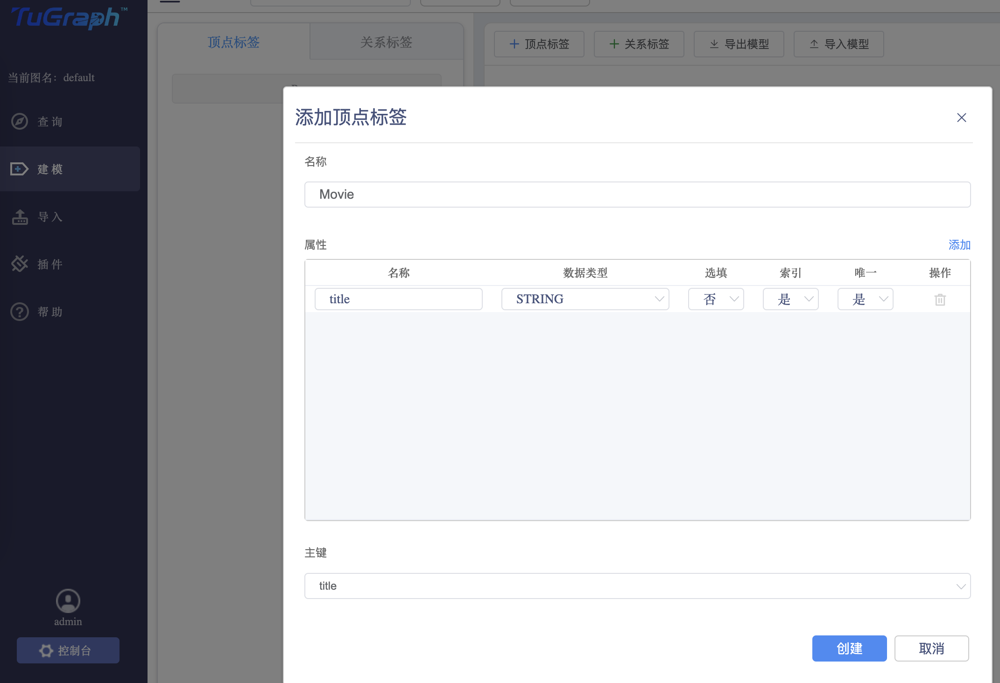
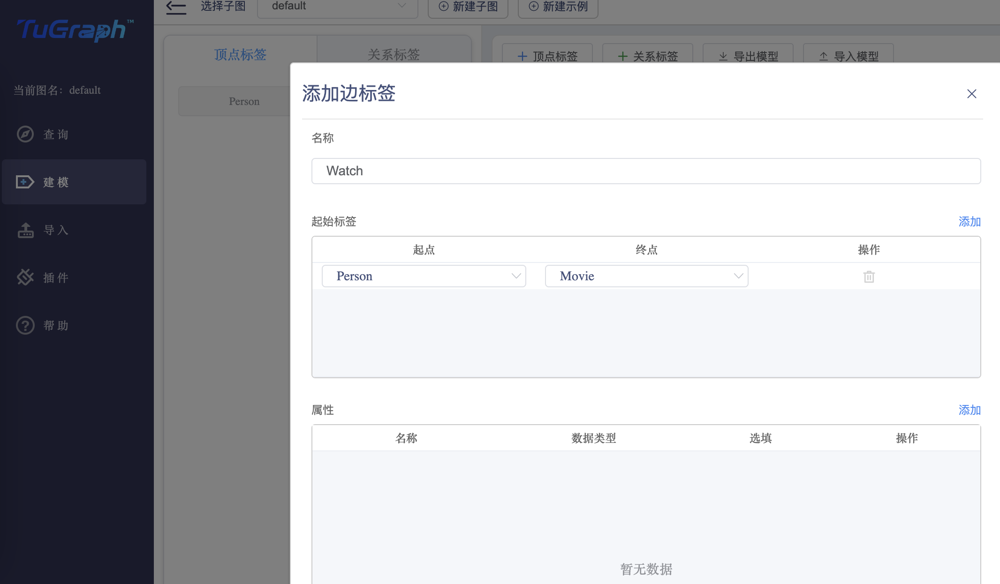
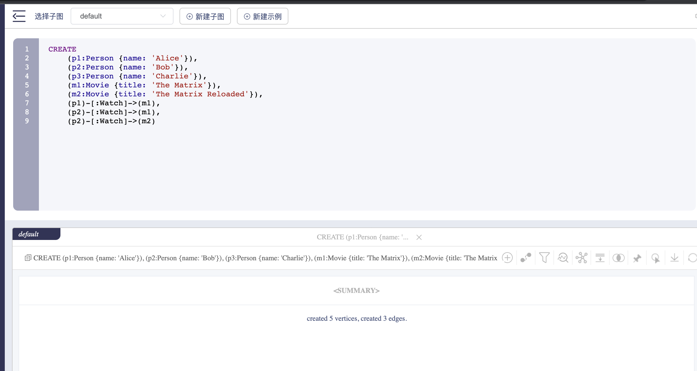
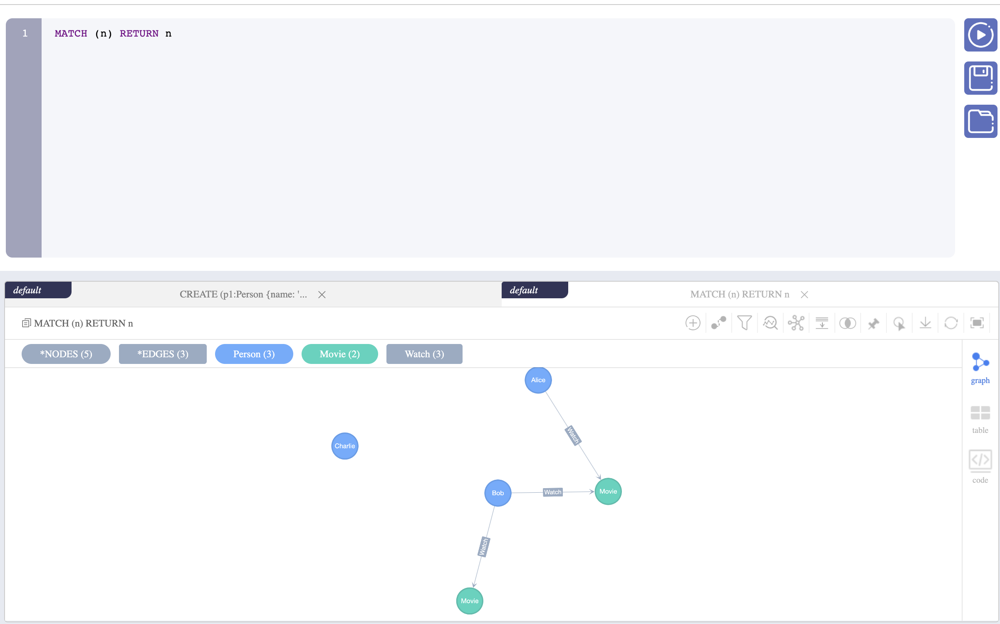
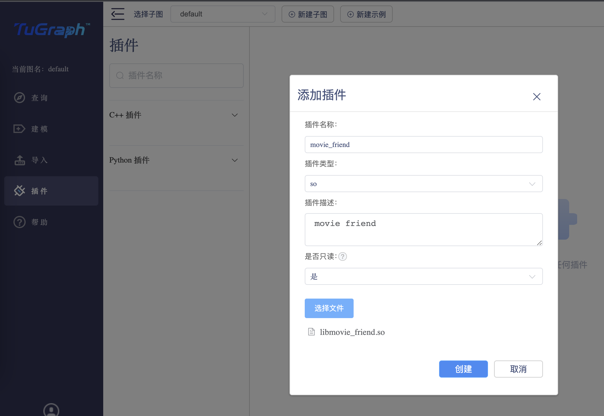
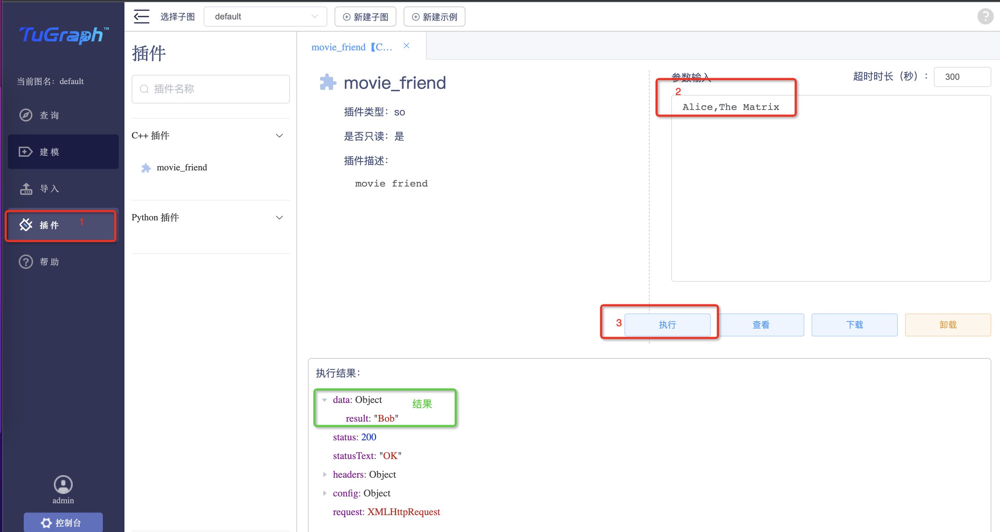

# TuGraph中使用Rust语言编写插件

TuGraph是一个高性能图数据库，它支持标准的Cypher查询语言，同时也支持插件机制，用户可以通过插件机制来扩展TuGraph的功能。TuGraph插件机制支持多种语言，包括C++, Python, Rust等。本文将介绍如何使用Rust语言编写TuGraph插件。

在这个教程中你会学习到：
- 如何使用vscode `Dev Containers`插件快速搭建开发环境
- 如何构建运行tugraph服务并通过web界面导入数据
- 如何编写rust-tugraph插件
- 如何在TuGraph中上传及使用rust插件

本教程所有代码都在[这里](https://github.com/antkiller996/tugraph-movie-friend)。


# 搭建开发环境
本文提供了vscode的开发环境，你可以通过vscode的`Dev Containers`插件来快速搭建开发环境。如果你不想使用vscode，你也可以通过使用.devcontainer/Dockerfile基于容器来构建开发环境。为了更好的Rust开发体验，我们推荐使用vscode。

## 安装vscode及其Dev Containers插件

vscode安装：请参考[vscode官网](https://code.visualstudio.com/)安装vscode。

Dev Containers插件：请参考[Dev Containers插件](https://marketplace.visualstudio.com/items?itemName=ms-vscode-remote.remote-containers)安装Dev Containers插件。

安装完毕后，在vscode插件栏中可以看到Dev Containers插件已经安装成功。



## 使用Dev Containers插件搭建开发环境
新建一个项目目录，取名为`rust-tugraph-plugin-tutorial`，然后在项目目录下新建一个`.devcontainer`目录，将[.devcontainer](https://github.com/antkiller996/tugraph-movie-friend/tree/master/.devcontainer)
下的内容全部拷贝到`.devcontainer`目录下。然后在vscode中打开项目目录，vscode会自动检测到`.devcontainer`目录下的配置文件，提示你是否打开一个新的容器化的开发环境，点击`Reopen in Container`按钮，vscode会自动构建一个容器化的开发环境。如果没有提示，你也可以通过vscode的命令面板(Ctrl+Shift+P或者Cmd+P)输入`Dev Containers: Reopen in Container`来打开容器化的开发环境。

在第一次打开容器化的开发环境时，vscode会自动下载容器镜像，这个过程可能会比较慢，请耐心等待⌛️。构建完毕时，使用 `cargo version` 来检测你是否拥有rust开发环境，如果你看到如下输出，那么恭喜你，你已经拥有了rust开发环境。

```bash
$ cargo version
cargo 1.68.0 (115f34552 2023-02-26)
```

# 构建运行tugraph服务准备数据

在使用Rust开发插件之前，我们需要先构建运行tugraph服务并登录web界面，这样我们才能在web界面中上传和使用我们的插件。接下来的步骤将介绍如何构建运行tugraph服务并登录web界面。

## 下载tugraph-db源码
```bash
$ git clone --recurse-submodules https://github.com/TuGraph-family/tugraph-db.git
```

## 构建tugraph-db依赖
```bash
$ bash tugraph-db/deps/build_deps.sh -j8
```
> **注意**
> 如果这个步骤在前端构建过程中跑挂了，重跑一次就好

## 构建lgraph_server
```bash
$ cmake -S tugraph-db -B build && cmake --build build --target lgraph_server -j 8
```

## 启动lgraph_server
```bash
bash -c "cd build/output && sudo ./lgraph_server -c ./lgraph_daemon.json -d start"
```

## 登录web界面并准备数据
访问[http://localhost:7070](http://localhost:7070), 在登录界面输入admin/73@TuGraph登录，登录成功后，在左侧导航栏选择建模，添加两类顶点`Person`, `Movie`, 一类边`Watch`.
- `Person`顶点包含属性`name`，并为唯一索引。
- `Movie`顶点包含属性`title`，并为唯一索引。
- `Watch`边，无属性。





建模完成后，我们往数据库中添加一些数据，这里我们使用[Cypher查询语言]添加了三个人，两部电影，以及他们之间的观看关系。
```cypher
CREATE
    (p1:Person {name: 'Alice'}),
    (p2:Person {name: 'Bob'}),
    (p3:Person {name: 'Charlie'}),
    (m1:Movie {title: 'The Matrix'}),
    (m2:Movie {title: 'The Matrix Reloaded'}),
    (p1)-[:Watch]->(m1),
    (p2)-[:Watch]->(m1),
    (p2)-[:Watch]->(m2)
```

通过 `MATCH (n) RETURN n` 可以查看所有点边可视化数据。



[Cypher查询语言]: (https://github.com/TuGraph-family/tugraph-db/blob/master/doc/zh-CN/source/5.developer-manual/6.interface/1.cypher.md)

# 使用Rust语言编写插件

恭喜你到了最后一步，在这一步中我们将使用Rust语言编写插件。这个插件功能是给定一个人名，电影名，寻找看过这部电影的其他人的名字。

## 创建rust library项目
```bash
cargo new movie-friend --lib
```

## 修改Cargo.toml配置清单
tugraph支持的插件类型包括：C++源代码，动态库so，以及Python源代码。这里，我们选择动态库so方式加载。
rust crate的默认编译结果是rust rlib文件类型，通过`lib.crate-type`字段，我们可以将它设置为动态库类型。
往movie-friend/Cargo.toml中添加如下配置：

```toml
[lib]
crate-type = ["cdylib"]
```

我们要使用rust-tugraph这个rust binding库来调用tugraph的api，以及使用tugraph-plugin-util这个工具库来简化
编写插件的流程。往movie-friend/Cargo.toml中添加如下依赖：

```toml
[dependencies]
tugraph = "0.1.4"
tugraph-plugin-util = "0.1.2"
```

rust-tugraph这个binding依赖tugraph-db的liblgraph.so, 会使用`LGRAPH_CXX_COMPILER`, `LGRAPH_C_COMPILER`
来构建它。如果没有设置，那么他会寻找系统默认的g++和gcc编译器来构建，通常情况下版本应该大于8.2。这里我们通过以上两个
环境变量来确保我们接下来的构建中都适用合适版本的编译器。

```bash
mkdir .cargo
cat <<EOF | tee .cargo/config
[env]
LGRAPH_C_COMPILER="/usr/local/bin/gcc"
LGRAPH_CXX_COMPILER="/usr/local/bin/g++"
EOF

```

```bash

```

运行cargo check来检查并下载依赖，并且构建liblgraph.so动态库，这个过程时间可能会有点长，请耐心等待⌛️。
```bash
cd movie-friend && cargo check --release -j 8
```
> ⚠️： 如果你不关心插件的运行性能，你可以使用默认的debug模式构建，此时你只需要通过cargo check -j 8进行检查即可。

## 编写插件核心代码
在movie-friend/src/lib.rs中将其替换成如下代码：
```rust
use std::error::Error;

use tugraph::{
    cursor::EdgeCursor, cursor::VertexCursor, db::Graph, field::FieldData, txn::TxnRead,
};

#[tugraph_plugin_util::tugraph_plugin]
fn movie_friend(graph: &mut Graph, req: &str) -> Result<String, Box<dyn Error>> {
    // req stores the request string from the web
    // its format is "person_name,movie_title"
    // parse from req to get person_name and movie_title
    let (person_name, movie_title) = parse_req(req)?;

    // create read only transaction
    let ro_txn = graph.create_ro_txn()?;
    let mut movie_index_iter = ro_txn.vertex_index_iter_ids_from(
        "Movie",
        "title",
        &FieldData::String(movie_title.clone()),
        &FieldData::String(movie_title),
    )?;

    let movie_id = movie_index_iter.next().ok_or("movie not found")?;

    // find the movie vertex with vid = movie_id
    let mut vertex_cur = ro_txn.vertex_cur()?;
    vertex_cur.seek(movie_id, false)?;
    // get all the watcher ids of the movie
    let watcher_ids: Vec<_> = vertex_cur.in_edge_cursor()?.into_edge_srcs().collect();

    // collect all user names through watcher ids
    let user_names = watcher_ids
        .iter()
        .map(|user_id| {
            let mut user_cur = ro_txn.vertex_cur()?;
            user_cur.seek(*user_id, false)?;
            user_cur.field("name").map(|name| match name {
                FieldData::String(name) => name,
                _ => panic!("name should be string"),
            })
        })
        .collect::<Result<Vec<_>, _>>()?;

    // return all user names except the person_name
    Ok(user_names
        .into_iter()
        .filter(|name| name != &person_name)
        .collect::<Vec<_>>()
        .join(","))
}

fn parse_req(req: &str) -> Result<(String, String), String> {
    let v: Vec<_> = req.split(',').collect();
    if v.len() != 2 {
        return Err("parse request error, format should be `Person.name,Movie.title`".to_string());
    }
    Ok((v[0].to_string(), v[1].to_string()))
}

```
这段代码使用了 `tugraph` 这个crate，它是tugraph的rust binding库，提供了tugraph的api接口。`movie_friend`函数是
插件的核心函数，它的输入是一个字符串，格式为`Person.name,Movie.title`，它的输出是一个字符串，格式为`Person.name,Person.name,...`。
所有的插件函数都需要使用`tugraph_plugin_util::tugraph_plugin`这个宏来修饰，并且函数签名必须为`fn(&mut Graph, &str) -> Result<String, E>`。

函数开始部分，我们首先解析请求字符串，获取到person_name和movie_title。然后创建一个只读事务，通过`vertex_index_iter_ids_from`函数
获取到movie_title对应的movie_id。

接下来我们需要获取这个movie的所有观看者。我们首先可以构建出`vertex_cur`并通过`seek`函数定位到movie_id所在顶点。接下来使用`in_edge_cursor`方法获取到
能够遍历所有入边的cursor，并调用它`into_edge_srcs`适配器方法将其转化为遍历所有入边起始点的迭代器。由schema所知，这些入边起始点就是指向这个movie的所有观看者顶点id。
最后通过`collect`方法将这些观看者顶点id收集起来。

离最终目标只差一步了。有了这些观看者顶点id，我们可以通过针对每个id，构建出相应的`vertex_cur`，并通过`field`方法获取到观看者的名字。最后通过`join`方法将所有观看者的名字。
返回给调用者之前，别忘记过滤掉person_name哦。

> `tugraph_plugin_util::tugraph_plugin`是一个由tugraph-plugin-util工具包提供的一个属性宏，它会将修饰的函数将被展开为能够被tugraph插件
> 系统调用的函数。关于属性宏的更多信息，可以参考[attribute macro]。关于tugraph-plugin-util工具包的更多信息，可以参考[tugraph-plugin-util]。

[attribute macro]: https://doc.rust-lang.org/reference/procedural-macros.html#attribute-macros
[tugraph-plugin-util]: https://crates.io/crates/tugraph-plugin-util

## 构建plugin

构建plugin，在`movie-friend/target/release/`下会生成`libmovie_friend.so`
```bash
cargo build --release -j 8
```

# TuGraph中使用rust plugin

## 上传插件
将上面步骤生成的`libmovie_friend.so`上传到tugraph插件页面。



## 使用插件
